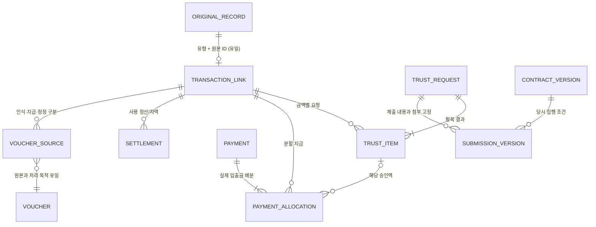

# 지출·신탁·지급·회계 통합 설계

기준일: 2026-09-08. 전체 목표는 첨부 요청서 1~10절이다. 단계별 커밋은 전체 완료나 운영 적용을 뜻하지 않는다.

## 현재 구조 / 문제 / 재사용할 기능 / 변경 내용

| 현재 구조 | 확인된 문제 | 재사용 | 변경 |
| --- | --- | --- | --- |
| 기안 `approval.documents`, 결의 `finance.expense_resolutions` | 일부 서버 처리가 고정 작성자·기본 조직을 사용함 | 문서번호·기안 연결·결재선·출력·증빙 | 검증된 사용자/조직으로 조회·명령 제한 |
| 독립 `quick_expense_records` | 화면 진입이 결의 작성과 혼재, 개인 대납은 조합 지급과 다름 | 원본 ID, 은행·카드 연결, 예산 판정 | 공통 등록 입구, 원본 유형 구분, 정산 연결 |
| `personal_reimbursements` | 개인 사용과 환급을 다른 지출로 중복 인식할 위험 | 접수/예외 승인·증빙·권한·예산/월별 정산 | 공통 거래 ID에 사용과 환급을 연결 |
| 결의 지급액·지급상태·은행 연결 | 상태 변경만으로 완료 가능, 지급 1건의 여러 지출 배분이 없음 | 과거 기록을 기준액으로 보존 | 실제 지급과 배분 원장, 정정/회수, 지급 조건 |
| `vouchers` + `voucher_lines` | 차·대변은 있으나 생성 경로의 계정 ID가 null, 지급완료만 생성 가능, 목록은 빈 배열 | 기존 전표번호·원본 연결 | 실제 조회, 인식/지급 분리, 계정 검토·확정·역분개 |
| 예산 예약·배분·마감 RPC | 신탁/지급 원장과 별개인 집행 기준을 유지해야 함 | 통합 예산의 원본 유형+ID, 예약 전환·조정 보고서 | 신탁 승인으로 집행 증가 금지, 공통 상세 연결 |
| 개인 경비 접수월 마감 | 전체 회계기간 잠금 기능이 아님 | 월별 정산 및 기존 보고서 버전 | 전체 월 마감은 미처리 점검; 정책 없는 잠금 비활성 |
| 계좌·카드 원본 | 외부 수납·환급 원장 연결을 이름으로 추측할 수 없음 | 실제 입출금/카드 ID·분류 | 납부항목/회차/고유 회원 ID와 명시적 연결, 이체 제외 |
| 미커밋 신탁 초안 | 조직 전체 JSON 한 행, 전체 단위 보완, 계약 변경 불가 등 요청 범위 미충족 | 분석 내용·기존 메뉴안 일부 | 항목/제출버전/계약버전/지급 배분을 독립 테이블로 구현 |

운영 읽기 조회 결과: 결의 6건/32,120,120원, 간편지출 5건/88,660원, 전표 0건, 결의 증빙 4건. 변경 전후 비교를 위해 건수·금액과 원본 행 지문을 별도 보관한다. 상태만으로 과거 지급 근거를 새로 만들지 않는다.

## 원본 연결 구조

- 원본 유형은 RESOLUTION, QUICK, PERSONAL, COLLECTION, REFUND, ADVANCE, TRANSFER로 구분한다. 기존 결의/간편/개인 원본은 이동·삭제하지 않는다.
- 같은 실제 거래를 나타내는 원본은 확인된 ID 연결만 허용한다. 간편지출→개인 환급은 같은 사용의 관계이며 비용 추가가 아니다.
- 거래 작성자·거래상대방·수취인, 거래일·회계일·예정일·실제 지급일은 독립 필드다. 지급일은 실제 지급 원장에서 읽는다.
- 지급은 실제 출금·입금 또는 승인된 현금 증빙에 연결한다. 카드 사용과 카드 결제대금 지급은 서로 다른 사건으로 연결한다.
- 기존 미확인 신탁 정보는 UNKNOWN이며 기록 조회/초안 작성은 허용한다. 계약 확인 없는 신탁 면제 실행은 금지한다.
- 확정 전표는 원본을 변경하지 않고 취소·정정 전표와 연결한다. 자동 계정 추정은 하지 않는다.

## 상태 전환표

| 축 | 전환 | 권한/근거 |
| --- | --- | --- |
| 내부 결재 | 작성→요청→승인 또는 반려→재요청 | 기존 결재선, 현재 담당자 ID, 자기 승인 제한 |
| 신탁 요청 | 준비→제출→심사 중→보완/일부 승인/승인/반려 | 계약버전·제출본·접수정보, 회신 첨부 |
| 신탁 항목 | 대기→승인/일부 승인/보완/반려 | 항목별 금액/사유; 보완 항목만 재제출 가능 |
| 철회 | 철회 요청→철회 확인 | 확인될 때까지 금액 예약 유지; 지급분 취소 금지 |
| 중요정보 변경 | 제출본 유지→재검토 필요→새 버전 제출 | 기존 승인 효력 재확인 전 추가 지급 제한 |
| 지급 | 미지급→부분지급→완료 | 실제 지급 근거+배분 합계; 내부/신탁 조건 충족 |
| 지급 정정 | 기존 배분 유지+취소 이벤트→새 배분 | 사유·담당자·시각, 은행 원본 삭제 금지 |
| 선지급 정산 | 지급→사용내역 제출→승인→잔액 반납/추가 지급→완료 | 사용 합계와 원지급액, 실제 반납/추가지급 연결 |
| 회계 | 초안→검토→확정→취소·정정 | 균형 분개·계정 지정·권한·사유 |
| 예산 | 예약→집행 또는 해제 | 기존 예산 정책과 마감 조정; 지급·신탁 승인과 독립 |

## 금액 규칙과 예제

- 확정액 A, 기존 확인 지급 기준액 L, 유효 신규 배분 P, 반환/회수 R을 각각 보존한다. 총 미지급은 A-(L+P-R). 과지급은 숨기지 않고 별도 회수 대상으로 표시한다.
- 승인액 V는 철회되지 않은 유효 항목 승인액. 승인 중 미지급 U=V-해당 승인에 배분된 지급액. 요청 중 예약 Q는 아직 결과가 확정되지 않은 항목의 금액이며 보완/철회 요청 중에도 유지한다.
- 추가 요청 가능액=max(0, A-누적 순지급-U-Q). 이미 지급된 승인액을 다시 빼지 않는다.
- 예: A=1,000, 승인 600 중 지급 200, 별도 심사 중 200 → 지급 200, 미지급 800, 승인 미지급 400, 추가 요청 가능 200.
- 일부 승인: 600 요청→400 승인→250 지급 → 미지급 750, 승인 미지급 150, 추가 요청 가능 600. 반려 200은 기존 요청 이력을 남기고 재요청 가능하다.
- 600 요청 중 항목1=400 승인, 항목2=200 보완 → 승인 미지급 400, 심사예약 200. 항목2 재제출이 항목1 승인액을 지우거나 중복 예약하지 않는다.
- 700 출금 1건을 지출A 250/지출B 150에 배분 → 미배분 300. 어느 경로에서도 총 배분 700 초과 금지.
- 1,000 선지급 후 사용800 → 반납200; 사용1,200 → 추가지급200. 반납/추가지급은 실제 거래가 연결되어야 완료.
- 동일 조합 계좌 간 이체 1,000은 현금 이동 1,000이며 비용·수납·예산 집행 증가 0.

## 메뉴/URL 대응

상단 업무 분류와 공통 틀 유지. 그룹 순서는 요청서 그대로이며 활성 상태는 label만이 아니라 path+tab 기준으로 결정한다.

| 그룹 | 메뉴 | URL | 기존 경로 |
| --- | --- | --- | --- |
| 처리할 업무 | 업무현황 | /finance/workspace | 신규 |
| 처리할 업무 | 결재함 | /finance/approval-inbox | 유지 |
| 지출·지급 | 지출관리 | /finance/expenses | /finance/expense-resolutions 문서/작성 경로 보존, /finance/quick-expenses 재사용 |
| 지출·지급 | 신탁 집행관리 | /finance/trust | 신규 |
| 지출·지급 | 지급관리 | /finance/payments?tab=waiting | payment-waiting→waiting, payment-completed→completed; 나머지 query 보존 |
| 지출·지급 | 대납·선지급 정산 | /finance/reimbursements | 기존 월별 정산·예산 링크 유지 |
| 수납·환급 | 분담금 수납관리 | /finance/collections | 기존 수납 ID 연결 |
| 수납·환급 | 환급관리 | /finance/refunds | 기존 환불금 지급관리 |
| 회계·증빙 | 수입·지출 전표관리 | /finance | 기존 번호와 상세 URL 보존 |
| 회계·증빙 | 계좌거래 매칭 | /finance/bank-transactions | 유지 |
| 회계·증빙 | 증빙자료 관리 | /finance/evidence | 원본 다운로드 연결 |
| 회계·증빙 | 세금계산서·계산서 | /finance/tax-documents | 등록 증빙 연결 |
| 예산·마감 | 예산집행 현황 | /finance/reimbursements?tab=budgets | 유지 |
| 예산·마감 | 월 마감 | /finance/month-close | 전체 점검 신규, 기존 접수월 마감 보존 |
| 설정 | 지출·신탁 설정 | /finance/workflow-settings | /finance/expense-settings 기존 지출 설정 연결 |

## 정책 확인 필요

법적 자금보관 위탁은 계약상 필수서류/공동동의/집행한도와 다르다. 현행 공식 조문 확인: https://law.go.kr/LSW/lsLinkCommonInfo.do?lsJoLnkSeq=1032750295 (2026-09-08 확인). 저장소 파일명 검색에서 실제 계약서·신탁 양식을 찾지 못했으므로 계약 확인으로 간주하지 않는다.

계약버전별 신탁사·계좌·적용조건·필수서류·공동동의·한도·운영비 선교부/정산조건을 명시적으로 설정한다. 미설정은 제출/해당 지급만 제한한다. 일반 조회/초안/증빙/회계 검토는 계속 가능하다. 회계 계정·인식시점·VAT·기간잠금 정책을 임의로 확정하지 않는다.

## 단계별 완료 기준

| 단계 | 구현물 | 완료 증거 | 현재 |
| --- | --- | --- | --- |
| 0 조사·설계 | 본 문서, 원본/상태/금액/URL 표, 보존 기준 | 소스·DB 구조 확인, 운영 읽기 기준값 | 완료 |
| 1 공통 연결·지급 기반 | 조직별 거래 연결, 지급/배분/반환, 원본 중복 방지, 감사 | 격리 PostgreSQL 저장·재조회·역할·다른 조직·중복/동시 처리 테스트 | 완료 (운영 미적용) |
| 2 신탁 | 계약 버전, 요청/항목, 제출 스냅샷, 첨부/회신/보완/철회/출력 | 혼합 항목 결과·재제출·분할지급·계약 미설정·정보변경 테스트 | 미완료 |
| 3 회계·정산·수납 | 기존 전표 연결, 인식/지급 분개, 정정, 선지급·회수·수납/환급 ID | 이중 비용 방지·정산 차액·회계 권한·원본 연결 테스트 | 미완료 |
| 4 화면·메뉴 | 공통 등록/상세/업무현황, 15개 메뉴, 구 URL 대응 | 저장/새로고침, 건수=목록, 권한, 활성/모바일/조건 보존 | 미완료 |
| 5 통합·운영 적용 | 데이터 대조·전체 검증·배포 확인 | 전체 시나리오별 증거, 정적검사/빌드, scoped commit/push, 운영 확인 구분 | 미완료 |

각 구현 단계는 저장·재조회·권한·중복 처리 검증 후 해당 범위만 커밋한다. 완료하지 않은 화면은 완료 기능처럼 공개하지 않는다. 미완성 사이드바가 운영에 먼저 배포되지 않도록 기능 연결까지 적용을 보류한다. 운영 검증용 송금·제출·결재·메일 발송은 하지 않는다.
